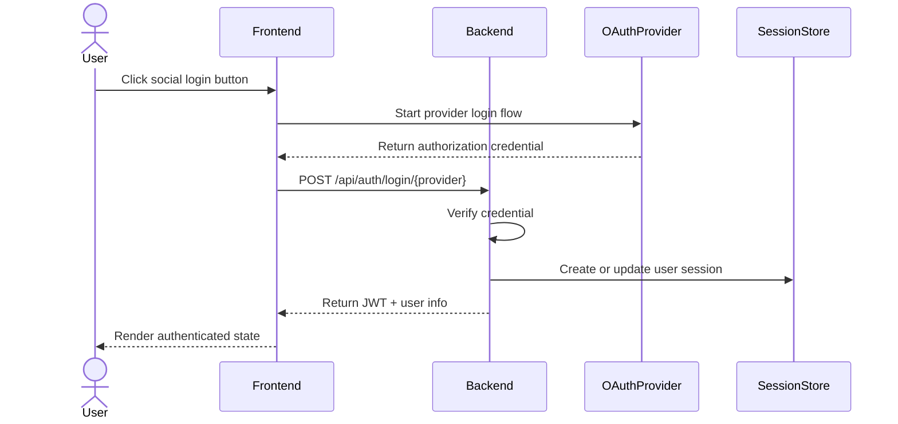
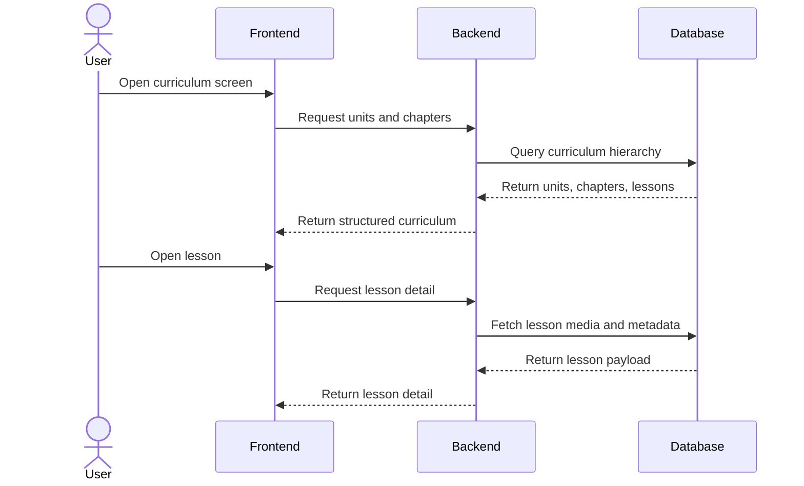
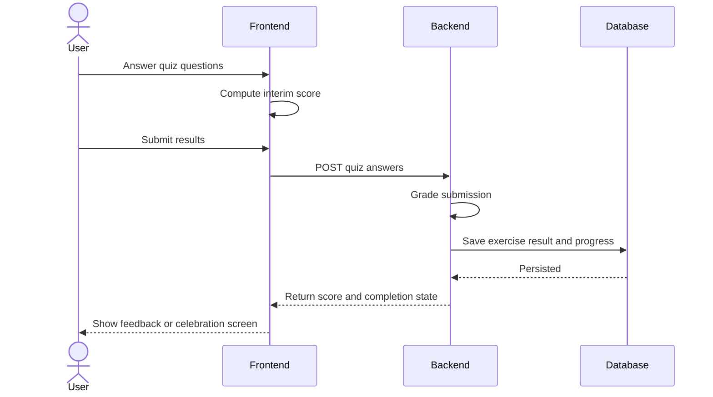
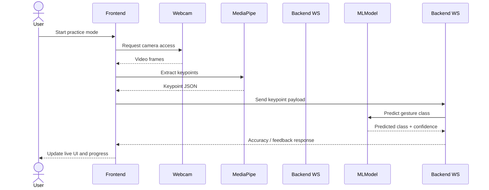

# Khmer Sign Language Platform

## Project Documentation

### Document Purpose

This document is a comprehensive technical and product-level description of the Khmer Sign Language Platform. It is written from the perspective of a senior software engineer and is intended to explain what the system is, who it serves, how it behaves, how it is structured, and how the major user journeys and backend workflows fit together.

The document is based on:

- `README.md`
- `DATABASE_FULL_SCHEMA.md`
- `docs.local/Khmer Sign Language Platform Docs.md`
- `docs.local/Khmer Sign language to-do list.md`
- The current backend and frontend workspace structure
- The available UI screenshots inside `sign language figma/`

This document also distinguishes between:

- What is already implemented in the current codebase
- What is clearly designed in the project documents
- What is still planned or partially implemented

---

## 1. Executive Summary

The Khmer Sign Language Platform is a bilingual Khmer/English learning system for sign language education. Its purpose is to help learners study sign language in a structured way, practice what they learned, search for signs in a dictionary, and eventually receive AI-assisted feedback from a webcam-based gesture evaluation pipeline.

The platform is intentionally split into two learning tracks:

- Sign Language track: video-heavy learning for signs, curriculum progression, dictionary lookup, exercises, and real-time AI practice.
- Finger Spelling track: image-based learning for Khmer letters and spelling, with a separate curriculum and practice flow.

From a product perspective, the system is not just a content library. It is designed as a guided learning environment with:

- Authentication and guest access
- Curriculum hierarchy and progress tracking
- Interactive quizzes and lesson completion rules
- Dictionary search and media playback
- AI practice and accuracy scoring
- User profile and learning statistics

From a technical perspective, the system follows a modern full-stack architecture:

- Frontend: Next.js, React, TypeScript, Material UI, Zustand
- Backend: FastAPI, Python, SQLAlchemy, Pydantic, JWT, OAuth
- Database: PostgreSQL
- Media and AI: structured around sign and finger spelling content, with a planned MediaPipe/WebSocket pipeline for real-time practice

---

## 2. Product Vision

The product exists to make Khmer sign language easier to learn, easier to practice, and easier to keep progressing through. The core idea is that a learner should be able to:

1. Log in quickly or continue as a guest.
2. Choose a learning path.
3. Progress through units, chapters, and lessons.
4. Review signs and spelling through video or image content.
5. Take quizzes that reinforce memory and recognition.
6. Practice with a webcam and receive AI feedback.
7. Track progress over time and see what is unlocked next.

The design documents also show a strong emphasis on bilingual access. Content is intended to be available in Khmer and English at most levels of the experience, including names, descriptions, explanations, and exercise options.

---

## 3. Product Goals

The main goals of the platform are:

- Teach Khmer sign language in a structured curriculum rather than through isolated media assets.
- Support both formal learning and casual browsing.
- Provide clear progression rules so the learner always knows what is locked, what is available, and what they have completed.
- Offer multimodal content: text, image, video, quizzes, and future webcam-based AI practice.
- Make the experience mobile-friendly and easy to navigate.
- Use authentication and session management so user progress can be stored and resumed.

Secondary goals include:

- Make the architecture maintainable and scalable.
- Support future content expansion.
- Allow the project to evolve from a content-learning app into an AI-assisted learning system.

---

## 4. Target Users and Roles

### 4.1 Student

The primary user is a student or learner. A student can:

- Sign in with OAuth or use a guest session
- Browse the curriculum
- View lesson content
- Take quizzes and practice activities
- Search the dictionary
- Track personal progress
- View a profile page with learning status and statistics

### 4.2 Guest

A guest is a low-friction visitor who can explore the platform without committing to a full account immediately. The docs describe guest access as a fast entry point for new users.

Guest behavior is intended for:

- Trying the platform quickly
- Browsing learning content
- Exploring the dictionary
- Possibly sampling a lesson before authenticating

### 4.3 Admin

The documentation mentions admin-level access for managing users, content, and platform operations. The exact admin UI is not yet visible in the workspace, but the data model and project planning imply future moderation and management capabilities.

---

## 5. User Interface Overview

The screenshots in `sign language figma/` show a consistent visual system:

- A bright orange header / accent color
- White and light gray surfaces
- Rounded cards and soft shadows
- A bottom navigation bar with Home, Practice, Dictionary, and Profile
- Mobile-first layout behavior, even when rendered on desktop

### 5.1 Home Screen

The home page is a landing/dashboard screen that presents two large learning cards:

- Sign Language
- Finger Spelling

This suggests the app intentionally separates broad learning modes rather than burying them in menus.

### 5.2 Login Screen

The login screen supports multiple authentication methods:

- Facebook
- Google
- Telegram
- Guest access

This is a strong sign that the platform is designed to lower onboarding friction while still supporting persistent authenticated sessions.

### 5.3 Lesson Screen

The lesson screenshot shows:

- An orange lesson header
- Progress indicator
- A large reference video area
- Khmer and English labels
- A continue action

This indicates the lesson flow is meant to be highly guided and visually clear.

### 5.4 Practice Screen

The practice screen shows a list of chapters, each with:

- Chapter number label
- Chapter title
- Score or completion indicator
- Lock icon for locked chapters

This reinforces the idea of progression gating.

### 5.5 Profile Screen

The profile screen shows:

- User avatar
- User name and email
- A minimal clean profile area

This is consistent with a learning app where account identity and learning progress are tied together.

---

## 6. Functional Scope

## 6.1 Authentication and Session Management

Authentication is designed around multiple channels:

- Google OAuth
- Facebook OAuth
- Telegram auth
- Guest login
- JWT-based session handling

The backend route in the current workspace shows active OAuth handling, including a test login page and Telegram redirect flow. The auth layer is currently implemented with a mock in-memory user store, which is adequate for development but not for production persistence.

Expected authentication behavior:

- User initiates login from the frontend
- Provider verifies identity
- Backend issues an application JWT
- Frontend uses the authenticated session for protected requests
- Logout clears the session

### Security expectations

The project docs and code indicate a secure-cookie-oriented design for session handling, with JWT as the main identity token. The intended direction is to protect sessions using HttpOnly cookies and secure transport in production.

---

## 6.2 Curriculum Learning System

The curriculum is hierarchical:

- Unit
- Chapter
- Lesson

Each lesson is a concrete learning page that may include:

- Video content
- Image content
- Khmer text
- English text
- Progress tracking
- Unlock rules
- Exercises

The lesson flow is designed so that one lesson can depend on another, and progress can unlock subsequent content.

Key concepts:

- Units group broad topics.
- Chapters subdivide those topics.
- Lessons present the actual learning content.
- Completion status and accuracy determine unlock behavior.

The project documents show this structure for both sign language and finger spelling.

---

## 6.3 Dictionary and Search

The dictionary is a searchable sign lookup system intended for both Khmer and English searches.

Expected dictionary behavior:

- Search by word or phrase
- Display matching sign entries
- Show detail pages with media playback
- Use an auto-looping, muted HTML5 video player for sign demonstrations
- Support pagination for browsing the full catalog

The dictionary is an important support feature because learners often need a fast reference outside the sequential curriculum.

---

## 6.4 Exercises and Quiz Engine

The exercise system is designed to test recognition and recall in several formats:

- Multiple choice using text prompts
- Multiple choice using video prompts
- True/False questions
- Text input questions

The docs also mention live feedback, where correct and incorrect answers are visually reinforced.

The quiz engine is supposed to handle:

- Question ordering
- Score calculation
- Distractor generation
- Per-lesson submission
- Completion triggers
- Unlocking the next lesson when thresholds are met

This means the quiz engine is not just a UI feature. It is part of the learning progression model.

---

## 6.5 Real-Time AI Practice

The long-term differentiator in the project is real-time sign practice with AI assistance.

Planned behavior:

- Open the webcam using browser media access
- Display reference content next to the live camera feed
- Extract pose or hand keypoints using MediaPipe
- Send those keypoints over a WebSocket connection
- Run model inference on the backend
- Return predicted class and confidence score
- Update the UI live with accuracy feedback
- Auto-complete a lesson when the learner reaches a passing threshold

This turns the app from a static learning platform into an interactive coaching tool.

---

## 6.6 User Profile and Learning Statistics

The profile area is intended to provide:

- Identity details
- Total scores
- Lesson and chapter completion state
- Progress charts or summaries
- Logout/session controls

This makes the platform feel personalized and gives learners a sense of progress continuity.

---

## 7. Learning Tracks

## 7.1 Sign Language Track

The sign language track is the richer, video-oriented path. It includes:

- Units, chapters, and lessons
- Sign media and lesson media references
- Dictionary words and example sentences
- Exercises and options
- Practice sessions
- Keypoint capture and AI inference results

This is the track that most clearly supports the webcam-based practice pipeline.

## 7.2 Finger Spelling Track

The finger spelling track is image-based and structured similarly, but its lesson media is image oriented rather than video oriented.

Its purpose is to teach the learner the Khmer alphabet and spelling-related hand signs.

The docs explicitly state that finger spelling is image-based only, which is a useful design distinction:

- Sign language learning can use videos
- Finger spelling can use static images

This is a better domain model than trying to force all content into one media style.

---

## 8. Key User Stories

### 8.1 First-Time Visitor

As a first-time visitor, I want to enter the platform quickly and understand the two learning modes so I can start learning without being overwhelmed.

Acceptance expectations:

- I can see the learning modes immediately.
- I can sign in using social login or continue as a guest.
- I can understand where the curriculum, practice, dictionary, and profile live.

### 8.2 Student Browsing Curriculum

As a student, I want to browse units, chapters, and lessons so I can follow a structured learning path.

Acceptance expectations:

- I can see what is unlocked.
- I can open a lesson only when permitted.
- I can resume from my prior progress.

### 8.3 Student Taking a Lesson

As a student, I want to view lesson media, text, and controls so I can learn the sign properly.

Acceptance expectations:

- The lesson shows clear content.
- The interface is easy to follow on mobile.
- I can continue to exercises or the next lesson.

### 8.4 Student Taking Quizzes

As a student, I want to answer questions about a lesson so I can validate what I learned.

Acceptance expectations:

- Question types vary to keep the experience engaging.
- Correct and incorrect answers are clearly indicated.
- My score is saved.
- Progress can be unlocked based on results.

### 8.5 Student Searching the Dictionary

As a student, I want to search the dictionary by Khmer or English so I can quickly look up a sign.

Acceptance expectations:

- Search returns relevant entries.
- Each entry shows sign media.
- Results can be browsed efficiently.

### 8.6 Student Practicing with AI

As a student, I want to use my webcam and get feedback so I can improve my sign accuracy.

Acceptance expectations:

- I can start a live practice session.
- I can see reference content and camera input.
- I receive live confidence or accuracy feedback.
- Passing performance may complete the lesson automatically.

### 8.7 Returning User

As a returning user, I want my progress preserved so I can continue from where I stopped.

Acceptance expectations:

- My session is restored.
- My profile shows progress.
- Previously completed content remains completed.

---

## 9. Primary Use Cases

| Use Case | Actor | Outcome |
|---|---|---|
| UC-01 Login with Google | Student | User receives an application session and enters the app |
| UC-02 Login with Facebook | Student | User receives an application session and enters the app |
| UC-03 Login with Telegram | Student | User receives an application session and enters the app |
| UC-04 Continue as Guest | Visitor | User enters the app without a persistent account |
| UC-05 Browse Curriculum | Student or Guest | User views units, chapters, and lessons |
| UC-06 Open Lesson | Student | User sees lesson media and instructions |
| UC-07 Submit Quiz | Student | Answers are graded and progress is updated |
| UC-08 Search Dictionary | Student or Guest | User finds a sign entry by text search |
| UC-09 Start AI Practice | Student | Webcam session begins and feedback is streamed |
| UC-10 View Profile | Student | User sees statistics and learning progress |

---

## 10. Main Sequence Diagrams

### 10.1 OAuth Login Flow

### 10.2 Curriculum and Lesson Flow

### 10.3 Quiz Submission Flow

### 10.4 Real-Time AI Practice Flow

---

## 11. System Architecture

The platform is organized as a classic three-layer application with external integrations.

### 11.1 Frontend Layer

The frontend is built with Next.js and React. It is responsible for:

- Rendering the UI shell
- Displaying curriculum and practice screens
- Handling login and session-driven navigation
- Calling backend APIs
- Managing local UI state with Zustand
- Presenting responsive layouts for mobile and desktop

### 11.2 Backend Layer

The backend is a FastAPI service. It is responsible for:

- Authentication and token issuance
- OAuth verification
- Curriculum and progress APIs
- Dictionary and media APIs
- Quiz grading and result persistence
- Future WebSocket handling for AI practice

### 11.3 Database Layer

The database is a single PostgreSQL instance. It is logically split into:

- Shared tables
- Sign track tables
- Finger track tables

This is a clean design because it keeps one deployment unit while preserving domain separation.

### 11.4 External Systems

External or planned dependencies include:

- OAuth identity providers
- Browser webcam APIs
- MediaPipe for keypoint extraction
- A future ML inference model
- Optional media storage backends

---

## 12. Database Model Summary

The schema is one of the most important parts of this project because it defines how the learning experience is stored and measured.

### 12.1 Shared Tables

The shared area stores identity and progress data:

- `users`
- `user_oauth_providers`
- `user_sessions`
- `user_lesson_progress`
- `user_exercise_results`

These tables are cross-track and support both sign language and finger spelling.

### 12.2 Sign Track Tables

The sign track supports the video-heavy learning mode:

- `sign_units`
- `sign_chapters`
- `sign_lessons`
- `sign_media`
- `sign_lesson_media`
- `sign_words`
- `sign_word_media`
- `sign_lesson_words`
- `sign_exercises`
- `sign_exercise_options`
- `sign_practice_sessions`
- `sign_practice_session_keypoints`

This structure supports curriculum, media, dictionary, quizzes, and AI practice telemetry.

### 12.3 Finger Track Tables

The finger spelling track mirrors the sign track with its own content set:

- `finger_units`
- `finger_chapters`
- `finger_lessons`
- `finger_media`
- `finger_lesson_media`
- `finger_words`
- `finger_word_media`
- `finger_lesson_words`
- `finger_exercises`
- `finger_exercise_options`

This parallel structure is a strong domain decision because it allows each learning mode to evolve independently.

### 12.4 Important Schema Patterns

Several schema design choices stand out:

- UUIDs are used for identity and session-oriented tables.
- BIGINT identity keys are used for content tables.
- Multi-language content is built into the schema.
- Media is abstracted through reusable media tables.
- Progress and results are separated so that cumulative state and attempt-level detail are both available.
- Practice sessions can capture frame-by-frame keypoints for later analysis.

---

## 13. API Surface

### 13.1 Implemented Auth APIs

The current workspace shows active authentication endpoints under the `/api/auth/login` route group.

Observed endpoints include:

- `POST /api/auth/login/google`
- `POST /api/auth/login/facebook`
- `POST /api/auth/login/telegram`
- `GET /api/auth/login/telegram/auth`

The test login page in the frontend is already wired to these flows.

### 13.2 Planned Learning APIs

The docs define a broader API surface for learning content:

- Units and chapters listing
- Lesson detail retrieval
- Exercise retrieval
- Progress submission
- Dictionary search and detail retrieval

### 13.3 Planned Practice APIs

The docs also define practice endpoints for:

- Chapter hub listing
- Chapter quiz content retrieval
- Result submission

### 13.4 Planned Real-Time APIs

The AI practice layer implies a WebSocket endpoint for sending keypoints and receiving model predictions.

---

## 14. Non-Functional Requirements

### Performance

- The UI should load quickly and feel lightweight.
- Search and curriculum navigation should return responses quickly.
- Real-time practice should keep latency low enough to be usable during live gesture feedback.

### Security

- JWT-based sessions are used for authentication.
- OAuth credentials should not be exposed to the client.
- Production cookie settings should favor secure transport.

### Maintainability

- The codebase uses a modular frontend/backend split.
- The database schema separates shared and track-specific concerns.
- SQLAlchemy and Pydantic provide a strongly typed backend foundation.

### Scalability

- The single PostgreSQL design can scale vertically first and later be optimized by workload.
- WebSocket practice sessions must be designed carefully because they will create real-time load.

### Usability

- The app is designed for mobile-first navigation.
- The bottom nav pattern makes the main areas easy to access.
- The screens are visually simple and content-focused.

### Reliability

- Progress and completion data must be durable.
- AI feedback should fail gracefully if the webcam or inference pipeline is unavailable.

---

## 15. Current Implementation Status

The project documentation shows a broader target than the current codebase implementation. Based on the repository inspection, the status can be summarized as follows:

### Implemented or clearly active

- OAuth login routes exist in the backend.
- A test login page exists in the frontend.
- The database schema is fully documented.
- The UI direction is represented by screenshots.

### Designed but not yet fully implemented

- Curriculum API routes
- Dictionary API routes
- Exercise engine logic
- Lesson progress persistence logic
- WebSocket AI practice pipeline
- Real ML inference pipeline
- Full production backend persistence for OAuth users

### Scaffolded but minimal in code

- The frontend app router is present but the landing page is still the default template.
- Core application pages and reusable components are not yet fleshed out in the workspace.

This is important because the docs describe a mature product vision, while the repository itself still contains a mixture of foundation work, test scaffolding, and planned architecture.

---

## 16. Technical Risks and Considerations

### 16.1 Mock Authentication Store

The current backend auth route uses an in-memory mock user store. That is acceptable for development testing, but it is not production-safe because it does not persist across process restarts.

### 16.2 Dual Track Schema Complexity

Maintaining two parallel curriculum tracks is a good domain fit, but it increases schema, API, and UI complexity.

### 16.3 WebSocket and AI Complexity

The real-time practice feature will be the hardest part of the platform. It depends on:

- Stable browser camera access
- Efficient keypoint extraction
- Low-latency WebSocket transport
- A reliable inference model
- Clear UX feedback when confidence is low or the model is uncertain

### 16.4 Media Management

The schema is prepared for media storage abstraction, but upload and delivery strategy still need to be fully wired.

### 16.5 Progress Logic

The lesson unlocking model needs careful business rules. If the rules are too strict, users get blocked. If they are too loose, the learning flow loses structure.

---

## 17. Recommended Development Roadmap

If this project were to continue in a disciplined sequence, the development order should be:

1. Finalize core backend models and persistence.
2. Implement curriculum APIs and lesson detail endpoints.
3. Implement dictionary search and media delivery.
4. Implement quiz generation, grading, and progress updates.
5. Build profile and statistics APIs.
6. Introduce the WebSocket practice pipeline only after the content and progress model are stable.
7. Harden authentication for production deployment.
8. Add admin management capabilities last, after learner workflows are stable.

This order reduces risk because it establishes the content platform before the real-time AI layer is introduced.

---

## 18. Product Narrative

In plain language, this project is a learning platform for Khmer sign language that combines structured lessons, searchable reference material, quiz-based reinforcement, and future live AI coaching.

If the project succeeds, a learner should be able to start as a guest, browse the content, sign in later, continue from where they stopped, search for signs instantly, and eventually practice with real-time feedback from the webcam.

That combination of curriculum, dictionary, progress tracking, and live practice is what makes the project more than a simple content site. It is intended to become a complete digital learning environment for Khmer sign language.

---

## 19. Appendix: Source Artifacts Reviewed

- `README.md`
- `DATABASE_FULL_SCHEMA.md`
- `docs.local/Khmer Sign Language Platform Docs.md`
- `docs.local/Khmer Sign language to-do list.md`
- `backend/src/routes/oauth.py`
- `frontend/src/app/page.tsx`
- `frontend/src/app/test-login/page.tsx`
- Screenshots in `sign language figma/`
